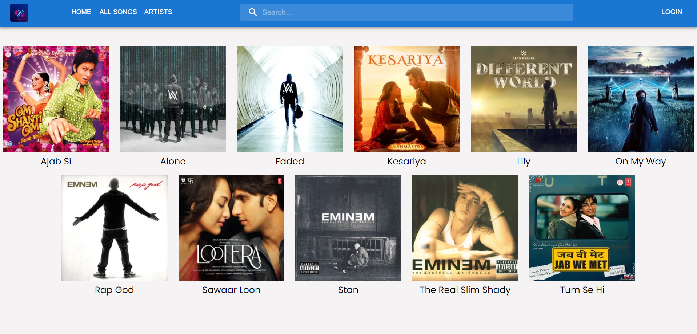
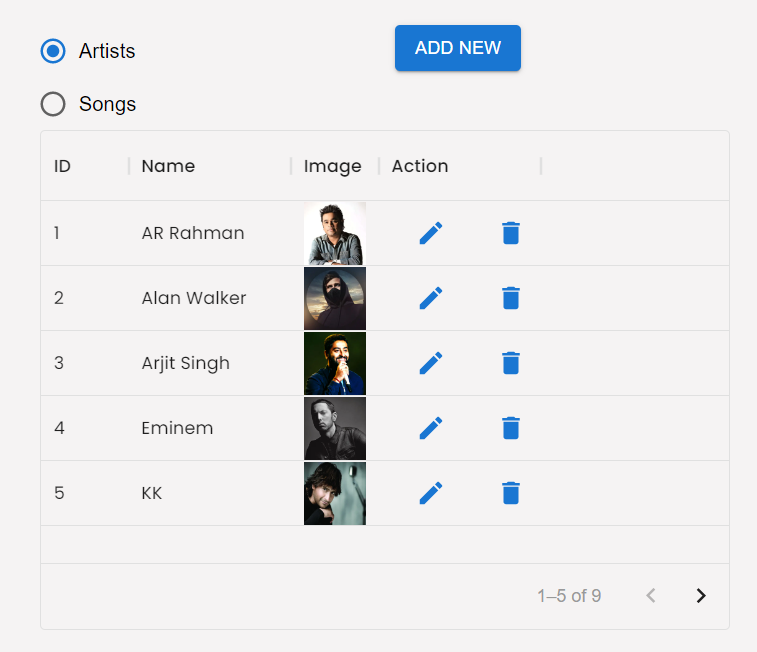

# Musicily
Music App - Music Streaming Platform

# Problem Statement
A platform where user can browse through their favouraite music from their favouraite Artists. The user can login to the app and can enjoy from a list of available music of their choice.

# Motivation
To provide people with an easy-to-use platform to browse and play music conviniently. They will be able to search for music available or go through music sorted by thier respective artists. The website provides for searching users choice of music and displaying all liked music at one place in an ordered and convinient manner.

<h1 id="folderstructure">Folder structure</h1>
   
    ├── client
    │   ├── nodemodules
    |   |── public
    |       |── index.html
    |   |── src
    │       ├── components
    │           ├── AddArtist.jsx
    │           ├── AddSong.jsx
    │           ├── artist.jsx
    │           ├── editArtist.jsx
    │           ├── editSong.jsx
    │           ├── homenavbar.jsx
    │           ├── navbar.jsx
    │           ├── song.jsx
    │       ├── pages
    │           ├── Add.jsx
    │           ├── Admin.jsx
    │           ├── Artist.jsx
    │           ├── Home.jsx
    │           ├── index.js
    │           ├── Liked.jsx
    │           ├── Login.css
    │           ├── Login.jsx
    │           ├── Signup.jsx
    │           ├── Song.jsx
    │           ├── User.jsx
    │       ├── App.js
    │       ├── index.css
    │       ├── index.js
    │       ├── logo.png

    ├── server
    |   |── controllers
    |       |── artist.js
    |       |── song.js
    |       |── user.js
    |   |── models
    |       |── artist.js
    |       |── song.js
    |       |── user.js
    |   |── routes
    |       |── artist.js
    |       |── index.js
    |       |── song.js
    |       |── user.js
    

    

# Tech Stack
MERN
- MongoDB
- Express.js
- React.js
- Node.js 

# Functionalities
- Login/Register
- Search for Music
- Play, pause and skip Music
- Like Music
- Naviagte via Navbar
- Add / Remove Music (Restricted to Admin)

# Members
16010120053 - Rohit Tawde 
16010120057 - Zain Azmi 
16010120058 - Vivek Iyer 

# Future Scope
In the future, we can implement Filtering of music based on genre and release date. 
Recommend users music as per their listening history. 
Let users create personalized playlists. 

# Technologies Used
node 16.16.0 
express 4.16.1 
mongoose 
react 
axios 
nodemon 2.0.20 
bycrypt 
react-dom 
Fontawesom 
emotion 
mui 
cors 

<h1 id="output">Output</h1>

All Songs

 

Admin Panel

